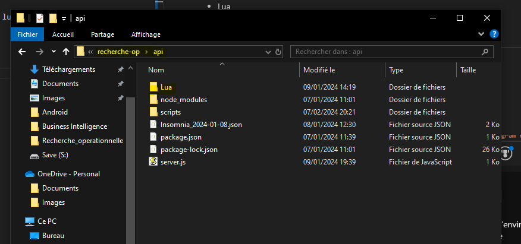
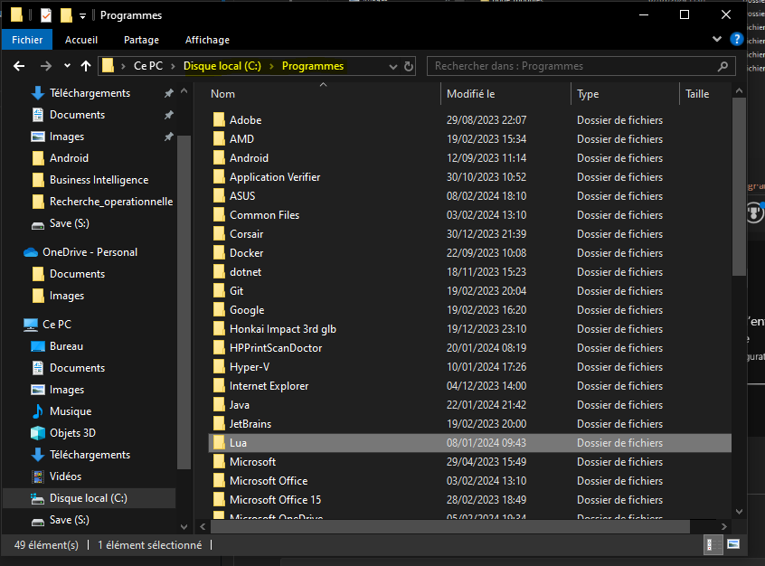
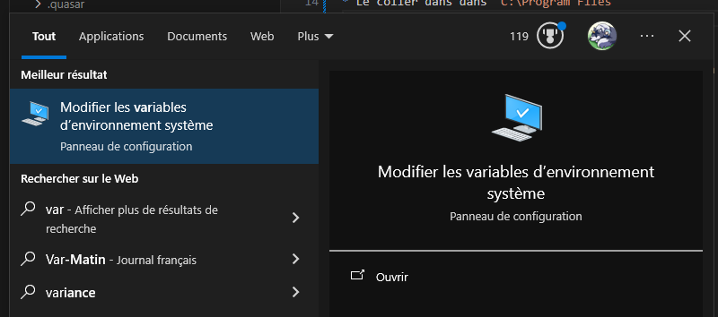
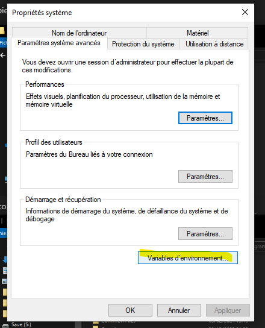
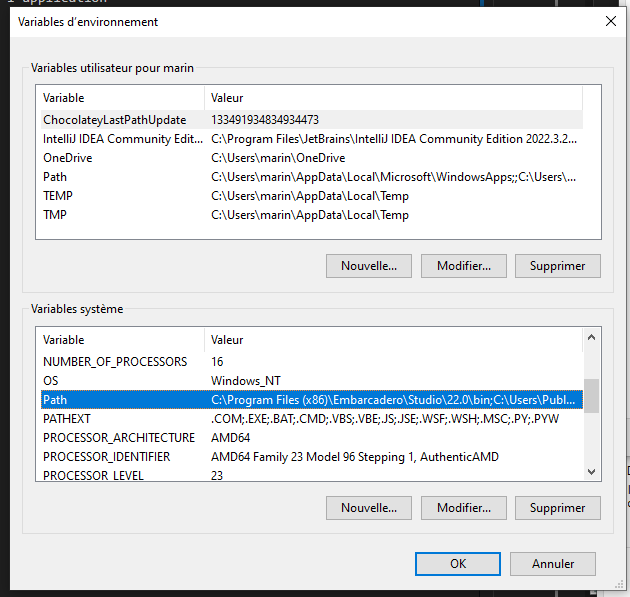
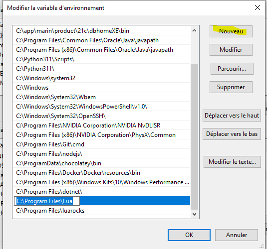
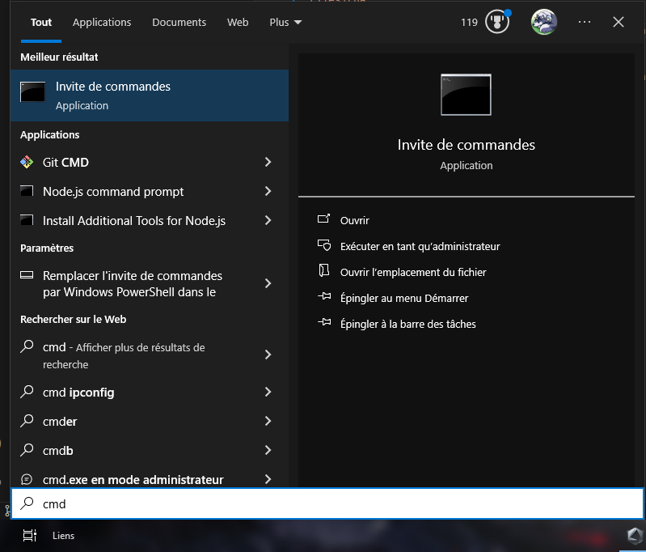
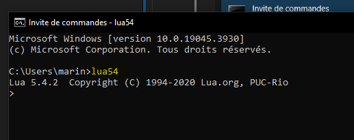

# Recherche Opérationnelle

Application regroupant différent algorithmes en lua en rapport avec la théorie des graphes.

## Built with
* JavaScript
* Lua

## Prérequis

Pour faire fonctionner les scripts en .lua, il faut avoir lua installer sur son ordinateur.

**Etape 1**
* Copier le dossier `Lua` présent dans /api

* Le coller dans dans `C:\Program Files`


**Etape 2**
* Ouvrir ses variables d'environnement


* Double cliquer sur `Path`

* Ajouter une nouvelle variable d'environnement en cliquant sur le bouton `Nouveau` en haut à droite. Entrer le chemin où Lua se trouve: `C:\Program Files\Lua`

* Vous pouvez fermer les fenêtres

**Etape 3**
* Pour tester que Lua a bien été installer, ouvrez un terminal.

* Entrez la commande `lua54`. Vous devriez avoir la même chose que l'image ci-dessous.


## Installer les dependences et lancer l'application
* Le dossier **api** contient l'api et les scripts lua
* Le dossier **app** contient l'application
```bash
# dans /api
npm install
npm run start
```
```bash
# dans /app
npm install
npm run dev
```